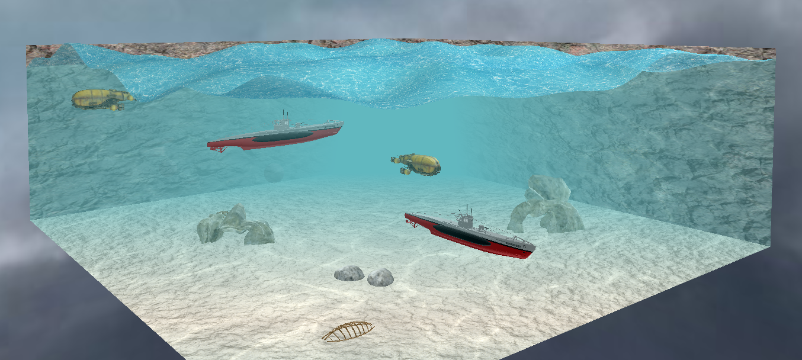
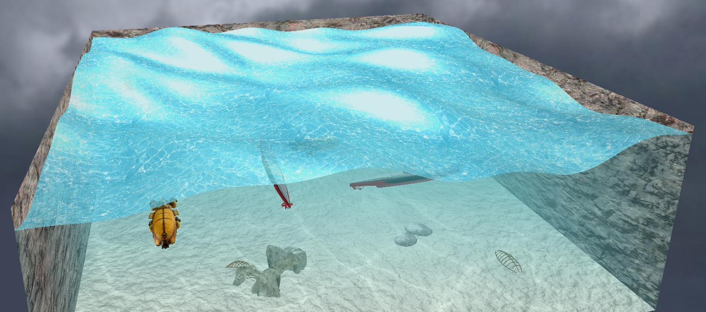
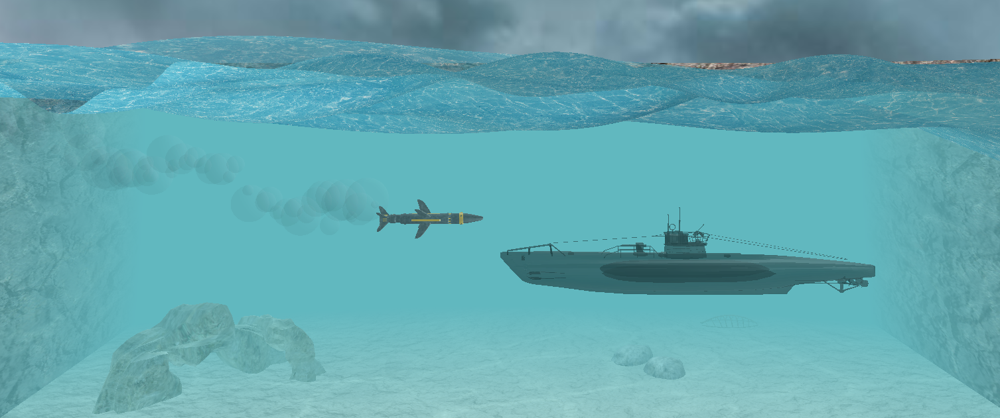

# battleship-game
Battleship game written as a university project in OpenGL.

## About the game
The idea for this game comes from a paper game [Battleship](https://en.wikipedia.org/wiki/Battleship_(game)). This game was written as a university project, thus the functionality is limited. Original game is for two people. This is a single player.

## How to play
Start `Game.exe`. You will see an aquarium with a few ships. You can redeploy the ships in the aquarium by dragging them with a left mouse button. Once you are happy with the arrangement, the battle can start. Pres `space` to start the battle. The ships become hidden. Since now you are controlling a torpedo. Launch the torpedo with a right mouse button and try to hit the ships. Have fun!

## Controls
| Action  | Key |
| ------------- | ------------- |
| Rotate aquarium  | `Left Mouse Button`  |
| Zoom  | `Scroll`  |
| Redeploy ship  | `Left Mouse Button`  |
| Start battle  | `Space`  |
| Launch torpedo  | `Right Mouse Button`  |

## Screenshots

## My contribution
The Battleship game was written by me and two other students. My part was graphics and effects. Mainly: 
* Water waves
* Water reflection
* Water fog
* Bubbles
* ...

